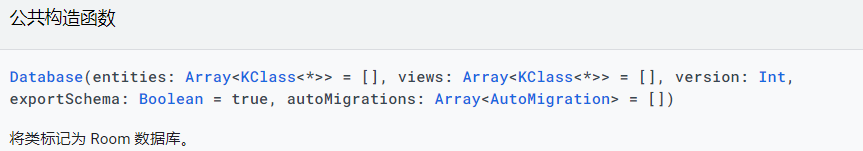

# Room-DB-demo-master
Room数据库使用demo

### Android官方文档链接 https://developer.android.google.cn/training/data-storage/room

####  数据库 https://developer.android.google.cn/reference/kotlin/androidx/room/Database

- **entities**: 数据库中包含的实体的列表。每个实体都会变成数据库中的一个表。
- **views**: 数据库中包含的数据库视图的列表。每个类都变成数据库中的一个视图。
- **version**: 数据库版本。
- **exportSchema**:  您可以设置注释处理器参数 （） 以告知 Room 将数据库架构导出到文件夹中。尽管这不是强制性的，但最好在代码库中包含架构的版本历史记录，并且应将架构文件提交到版本控制系统中（但不要随应用一起提供！room.schemaLocation
                     设置时，Room 将检查此变量，如果设置为 true，数据库架构将导出到给定文件夹中。room.schemaLocationtrue
                     默认情况下，值 为false ，但当您不想保留版本历史记录（如仅内存中的数据库）时，可以为数据库禁用该值。
- **autoMigrations**: 可对此数据库执行的自动迁移的列表。对于 [AutoMigration](https://developer.android.google.cn/reference/kotlin/androidx/room/AutoMigration) 未涵盖的更复杂的情况，
仍然可以使用运行时定义的 androidx.room.migration.Migration 以及 androidx.roomDatabase.Builder.addMigrations。
### Github源码参考链接 https://github.com/xieyangxuejun/sample-android-room

### 注：踩过的坑                                                                                                                                                                                                                                                                                                                                                                               
